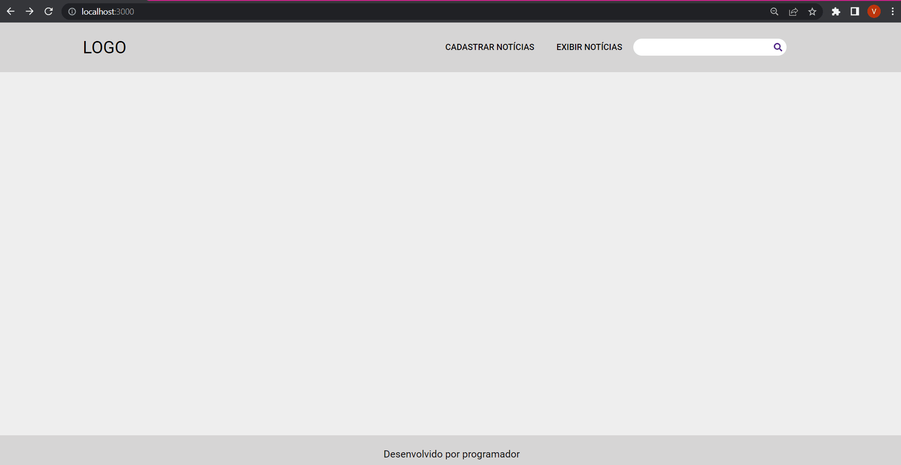

## Prova técnica DevMedia
Projeto baseado na prova técnica da DevMedia. O objetivo era testar as minhas habilidades para um caso de avaliação técnica.

## Tecnologias
>
Aqui está as tecnologias usadas no projeto

 - TypeScript 4.7.4
 - Node-sass 7.0.1
 - React 18.2.0
 
 ## Serviços usados
  
  - Github
  - Netlify

## Apresentação

## Funcionalidades

As principais funcionalidades são:
 - Criar notícias
 - Ler notícias
 - Pesquisar notícias por palavras-chaves

## Links
 - Repositório: https://github.com/Vinicius-B-Leite/devmedia-prova
 - deploy: https://prova-tecnica-devmedia.netlify.app/	
 - Em casos de bugs, por favor me contate
  viniciusbleite21@gmail.com

## Versão
 1.0.0

## Autor
Feito com <3 por Vinicius B. Leite